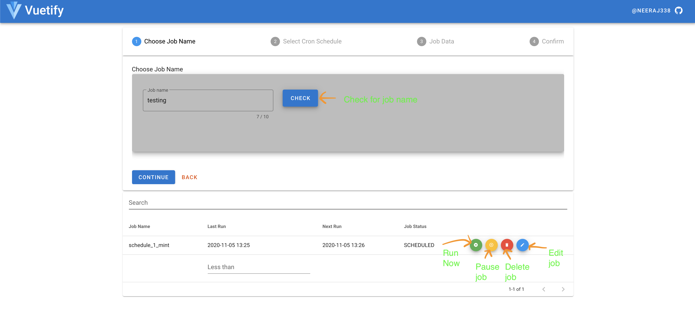

# spring-boot-quartz-scheduler
Spring Boot + Quartz + vueJs(Vuetify) application. 

Introduction:
--------------------
The solution provide managing and scheduling jobs which makes HTTP calls to supplied endpoint.
The good thing about the scheduler is that we can deploy it in clusters.(Inspired by quartz cluster mode setting)

 
 
System Requirements:
--------------------
- OpenJDK for Java 1.8
- Git
- Project Lombok https://projectlombok.org
- Flyway schema migration tool

Building the example project:
-----------------------------

Environment variable:

    export DB_NAME='<your_db_name>'
    export DB_HOST='<your_db_host>'
    export DB_PORT='<your_db_port>'
    export DB_USERNAME='<your_db_user>'
    export DB_PASSWORD='<your_db_password>'

Quartz schema creation:

    ./gradlew flywayMigrate
    
To build the fat JAR and run tests:

    ./gradlew build test

Run:

    java -jar build/libs/spring-boot-quartz-scheduler-1.0-SNAPSHOT.jar
    OR
    ./gradlew bootRun

Jacoco tst coverage:
    
    ./gradlew jacocoTestReport

Urls:
-----------------------------
application -> http://localhost:4567/

swagger -> http://localhost:4567/swagger-ui.html

Assumptions:
-------------------------
- Vuejs UI project could be run separately.
However, we can run it together by copying the vue-app/dist/ to src/main/resources/static/ folder
- To generate the Vuejs UI build follow ==> [link to section](./vue-app/README.md)

References:
-----------